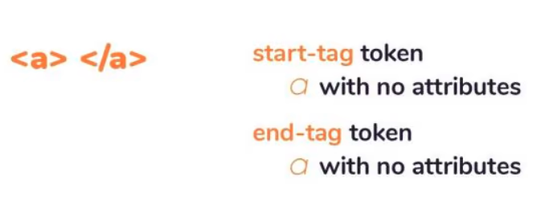
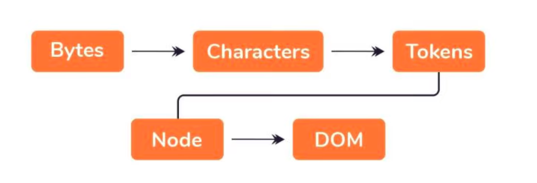
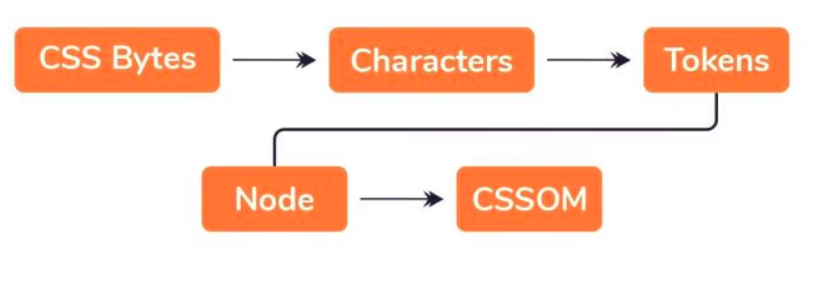

# Browser & Its Working

### What is a Browser?

1. Software Application which lets user access information worldwide.
2. Used to locate, fetch & display content on the internet which includes images, videos etc
3. Brings user requested information from remote server and displays it in a user-readable
   format.
4. Its a rendering machine which downloads a webpage & renders it a understandable way.

### Components of a Browser

1. User-Interface

   1. All Interactable control of a browser
   2. Includes AddressBar, Viewport for document, bookmarks etc
   3. User interacts through this

2. Rendering Engine

   1. Brain of a browser
   2. Translates/Parse the incoming html document to Human Readable format
   3. Generates DOM/CSSOM from html, css files and merge them to create a Tree

3. Networking

   1. This handles the communication part.
   2. May implement cache of retrieved documents inorder to reduce traffic

4. Javascript Interpreter

   1. Inbuilt JS interpreter responsible for embedding js code in webpage during rendering process
   2. If script is external, first script is fetched then it is parsed

5. DataStorage

   1. A storage layer created inside local machine where browser is installed
   2. responsible for storing data like cookies, caches, bookmarks

6. Browser Engine

   1. Act as a bridge between UI and Rendering Engine

7. UI Backend
   1. Used for drawing basic widgets like combo boxes.

### How Rendering Engine works?

Rendering engine i a piece of software which actually parse the recieved
html file into a webpage with all display and understandable content

Following steps takes place

1. Html is read as a raw bytes
2. Then raw bytes are converted to actual character using character set defined in html.
3. Those character are meaningless to the browser until they get converted to something meaningful which are called tokens
4. Each start tag and end tag is accounted by parser, For example, a token that represents an anchor tag will have different properties from one that represents a paragraph token.
   
5. But tokens are then converted to nodes which act as an independent object with specific properties

6. Then each nodes are linked in a kind of Tree data structure known as DOM.
7. The DOM establishes the parent-child relationships, adjacent sibling relationships, etc. The relationship between every node is established in this DOM object.

DOM contruction is the first thing any browser do upon receiving a html file, if file is large
then DOM creation takes time

#### But what about CSS?

While parsing **HTML FILE** parser may encounter the link tag for external **CSS** file, so it make a request to fetch CSS file.

Browser read CSS file in same way it does HTML file i.e through Raw Bytes which is not useful.
Therefore the same thing happen with CSS file and browser convert CSS file to CSS Tree Data Structure called CSSOM

Browser using CSSOM determines which element will have what styling affect, thanks to **CASCADE**
