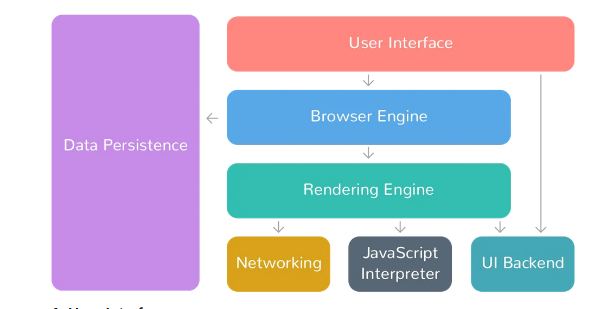

# Browser & Its Working

### What is a Browser?

1. Software Application which lets user access information worldwide.
2. Used to locate, fetch & display content on the internet which includes images, videos etc
3. Brings user requested information from remote server and displays it in a user-readable
   format.
4. Its a rendering machine which downloads a webpage & renders it a understandable way.

### Components of a Browser

1. User-Interface

   1. All Interactable control of a browser
   2. Includes AddressBar, Viewport for document, bookmarks etc
   3. User interacts through this

2. Rendering Engine

   1. Brain of a browser
   2. Translates/Parse the incoming html document to Human Readable format
   3. Generates DOM/CSSOM from html, css files and merge them to create a Tree

3. Networking

   1. This handles the communication part.
   2. May implement cache of retrieved documents inorder to reduce traffic

4. Javascript Interpreter

   1. Inbuilt JS interpreter responsible for embedding js code in webpage during rendering process
   2. If script is external, first script is fetched then it is parsed

5. DataStorage

   1. A storage layer created inside local machine where browser is installed
   2. responsible for storing data like cookies, caches, bookmarks

6. Browser Engine

   1. Act as a bridge between UI and Rendering Engine

7. UI Backend
   1. Used for drawing basic widgets like combo boxes.

